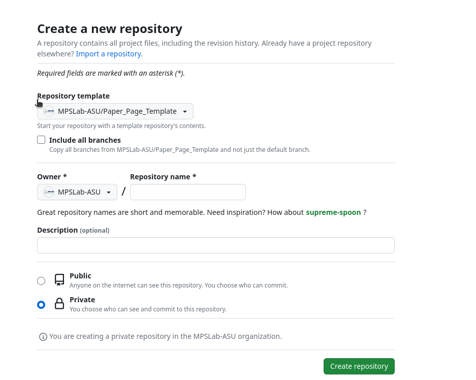
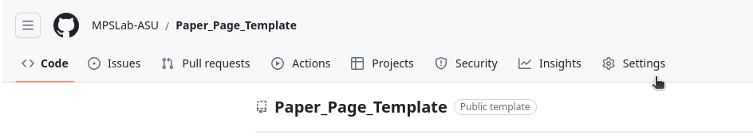
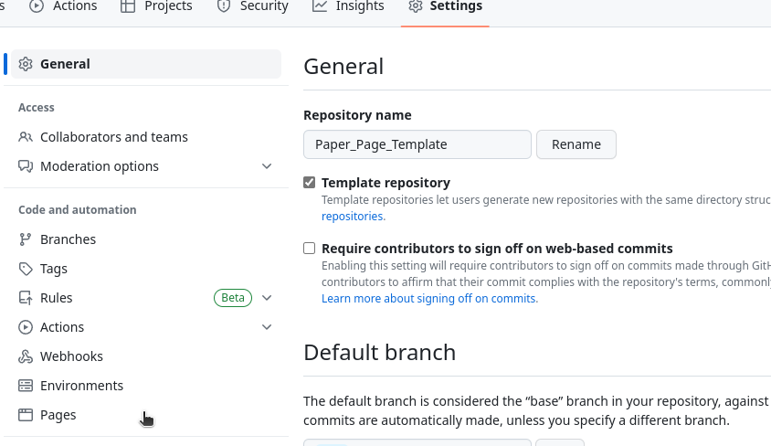
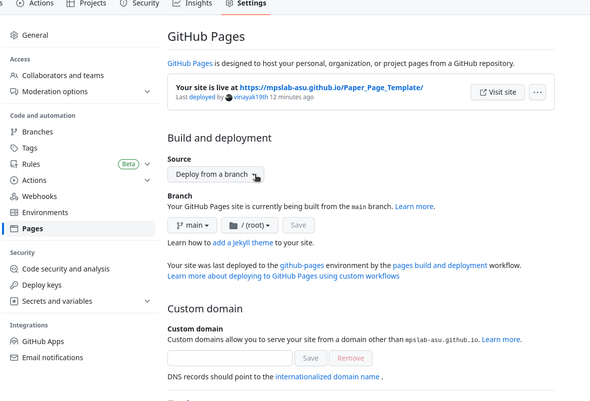

# Paper Page Template
This repo creates a template for an academic paper page. It has been set up so that no HTML coding is required for a paper page. All configuration is done through markdown and yaml files.

demo:  https://mpslab-asu.github.io/Paper_Page_Template/

## Requirements:
You need to use docker and docker-compose to run this project. If you don't have them installed, follow the instructions [here](https://docs.docker.com/compose/install/).

## Usage:
The files that need to be edited for any paper are:
* [_config.yml](./_config.yml)
* [_data/figures.yml](./_data/figures.yml)
* [_data/authors.yml](./_data/authors.yml)
* [paper_components/abstract.md](./paper_components/abstract.md)
* [paper_components/bibtex_ref.md](./paper_components/bibtex_ref.md)
* [paper_components/description.md](./paper_components/description.md)

Everything else should generate automatically.

---

## Modifing the template for your paper:
* Any fields that you do not want to use must be commented out in the yaml files. This is done by adding a '#' at the beginning of the line. (Ex: ln 12 in [_config.yml](./_config.yml) which comments out the supplementary_pdf)


## YAML Files:
### `_config.yml`:
The [_config.yaml](./_config.yml) file contains all the information about the paper. The only fields that need to be edited are:

**Paper Information** ->
* **paper_name** : The title of the paper
* **organization** : The organization that the paper is associated with
* **sub_organization** : The department that the paper is associated with
* **preprint** : (Boolean) If the paper is a preprint or not (True/False)

**Paper Resources** ->
* **paper_pdf** : The path to the pdf of the paper
* **supplementary_pdf** : The path to the supplementary pdf of the paper
* **code** : The path to the code for the paper (preferable GitHub)
* **arXiv** : The link for the arXiv page for the paper
* **IEEE** : The link for the IEEE page for the paper
* **ACM** : The link for the ACM page for the paper
* **favicon** : The path to the favicon for the paper page
  * All favicons must be .ico files. You can convert any image to a .ico file [here](https://cloudconvert.com/png-to-ico)
  * Make sure the is in the [assets/images](./assets/images) folder for GitHub pages compatibility


### `figures.yml`:
The [_data/figures.yml](./_data/figures.yml) file contains all the information about the figures for the paper. The only fields that need to be edited are:

* **filename** : The filename of the figure
  * The image needs to be in the [assets/images](./assets/images) folder for GitHub pages compatibility.
  * jpeg/jpg files must be name .JPG (all caps) for GitHub pages compatibility
* **caption** : The caption for the figure


### `authors.yml`:
The [_data/authors.yml](./_data/authors.yml) file contains all the information about the authors for the paper. The format for the file is:

```yaml
- name: Vinayak Sharma
  github: vinayak19th
  linkedin: vinayak19th
  email: vsharm87@asu.edu
  position: PhD in CS
  organization: Arizona State University
  sub_organization: School of Computing and Augmented Intelligence
  google_scholar: https://scholar.google.com/citations?user=r763skMAAAAJ&hl=en
  orcid: https://orcid.org/0009-0009-5633-4003  
  website: https://vinayak19th.github.io/
  primary: true
```

Each of these fields is optional. Any fields that are not used should be removed per author.
#### Additional Notes about author sections:
* The information here shows up on the cards screen when the author named is clicked on.
* The only fields represented on the main page are **name** and **primary**.
* **primary** is meant to indicate major contributors, it shows as "*" on the main page and a badge on the author cards

#### Supported Links for Authors:
* **github** : The GitHub username of the author
* **email** : The email address of the author
* **linkedin** : The LinkedIn username of the author
* **organization** : The organization that the author is associated with
* **sub_organization** : The department that the author is associated with
* **google_scholar** : The Google Scholar profile of the author
* **website** : The personal website of the author
* **position** : The position of the author (PhD, Postdoc, etc.)
* **orcid** : The ORCID page Link 
> Organization, sub_organization, and email are required fields.
Full list of fields can be found in the [index.html](./index.html) file inside the div 'card-footer bg-transparent"
---

## Markdown Files:

### `abstract.md` :
You [abstract.md](./paper_components/abstract.md) file should have the abstract for the paper. This is the only file that requires markdown.

### `bibtex_ref.md` :
The [bibtex_ref.md](./paper_components/bibtex_ref.md) file should have the bibtex reference for the paper. This is the only file that requires markdown.

### `description.md` :
The [description.md](./paper_components/description.md) file should have the description for the paper or any additional information you want to include. 
* This is the only file that requires markdown. 
* **Latex Math** is supported in this file.


---
## Hosting the Website:
The web hosting is handled by GitHub Pages. The process is rather straight forward. 

### **Step 1:** Create a Repository or Branch. 
* If you the paper **does not have code or a repository**, create a new repository. 
  * You can use the template option when creating the repo
  
  * Edit as per instructions above
<br>
* If you the paper **has a repository**, create a new branch in the repository. Preferable titled "pages"
  * Clone the repo and that branch and remove all existing code. 
  * Copy all files from this repo into the new branch and edit as per instructions above

### **Step 2:** Start git hosting. 
1. Go to the settings page of the repo:

2. Scroll down to the GitHub Pages section and select the branch you want to host from.

3. Select the host from branch option and save.



## You're Done !!!
